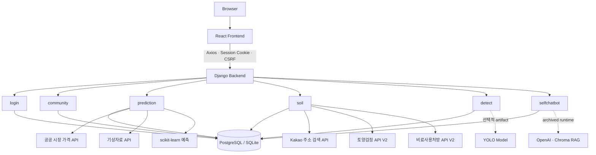

# 꾼꾼농사꾼

농업 데이터를 활용해 작물 수익 예측, 토양검정·비료 처방, 병해충 진단, 커뮤니티 기능을 제공하는 초보 농업인용 웹 서비스

<p align="center">
  
</p>

<!-- TODO: 대표 메인 화면 스크린샷으로 앱 아이콘 교체 또는 보완 -->

| 구분 | 내용 |
|---|---|
| 프로젝트 유형 | 농업 데이터 기반 팀 프로젝트 |
| 개발 형태 | React SPA + Django API |
| 주요 도메인 | 인증, 커뮤니티, 수익 예측, 토양·비료, 병해충, 챗봇 |
| 현재 Repository | 2024년 팀 프로젝트를 기반으로 구조와 안정성을 개선한 포트폴리오용 통합본 |

## 프로젝트 소개

농업 의사결정에 필요한 시장 가격, 기상, 토양, 병해충 정보는 여러 서비스에 흩어져 있습니다. 꾼꾼농사꾼은 초보 농업인이 작물 선택부터 재배 환경 확인까지 필요한 정보를 하나의 흐름에서 탐색할 수 있도록 기획한 농업 코파일럿 서비스입니다.

사용자는 지역·농지 면적·작물 조합을 바탕으로 예상 수익을 확인하고, 주소 기반 토양검정과 비료사용처방을 조회할 수 있습니다. 병해충 이미지 진단, 농업 커뮤니티, 회원별 기록 관리 기능도 함께 제공합니다.

## 주요 기능

### 작물 수익 예측

- 지역, 농지 면적, 작물과 재배 비율 입력
- 공공 시장 가격·기상 데이터와 농산물 소득 자료를 결합한 예측
- 예상 수익, 비용 정보와 가격 추이 시각화
- 사용자별 예측 세션 저장, 이름 변경, 상세 조회 및 삭제

### 토양검정 및 비료사용처방

- 작물과 주소를 기준으로 필지별 토양검정 결과 조회
- 산도, 유기물, 유효인산, 치환성 양이온 등 토양 화학성 표시
- 농촌진흥청 비료사용처방 정보 V2 연계
- 사용자별 토양·비료 결과 저장 및 조회

### 병해충 진단

- 이미지 선택, 미리보기 및 YOLO 기반 객체 탐지
- 신뢰도 임계값 미만 결과를 미탐지 상태로 안전하게 처리
- 모델 class와 병해충 상세정보의 검증된 매핑이 없으면 성공 결과를 생성하지 않는 제한 경계 적용

### 농업 커뮤니티

- 판매, 구매, 품앗이 게시판
- 게시글 작성·조회·수정·삭제
- 댓글·답글과 작성자 기준 관리 UI
- 내가 작성한 글과 댓글을 작성한 글 조회

### 농업 챗봇

- 원본 프로젝트의 OpenAI·Chroma 기반 RAG 대화 구조와 사용자별 세션 모델 유지
- 현재 Repository에서는 관련 corpus/vector DB가 배포 대상에 포함되지 않아 **ARCHIVED / LIMITED** 상태
- 런타임이 준비되지 않은 경우 가짜 답변 대신 제어된 `503` 안내 제공

### 회원 기능

- 회원가입, 로그인, 로그아웃과 마이페이지
- Django Session 기반 인증 및 CSRF 보호
- 사용자명·비밀번호 변경과 회원 탈퇴
- 이메일 링크와 일회성 토큰을 사용하는 비밀번호 재설정

## 서비스 화면

| 화면 | 설명 | 상태 |
|---|---|---|
| Main | 서비스 진입점과 핵심 기능 안내 | 촬영 예정 |
| Prediction | 작물 조합 입력과 예측 결과·차트 | 촬영 예정 |
| Soil | 필지별 토양검정과 비료 처방 결과 | 촬영 예정 |
| Detect | 이미지 업로드와 진단 결과 | 고신뢰도 이미지 검증과 함께 촬영 예정 |
| Community | 게시판 목록과 상세·댓글 | 촬영 예정 |

<!-- TODO: 작물 수익 예측 결과 화면 -->
<!-- TODO: 토양검정 및 비료 처방 성공 화면 -->
<!-- TODO: 병해충 진단 화면 -->

## 기술 스택

| 영역 | 기술 | 역할 |
|---|---|---|
| Frontend | React 18, React Router 6 | SPA 화면 구성과 클라이언트 라우팅 |
| Frontend | Axios | Django API 통신, Session cookie와 CSRF 연계 |
| Frontend | styled-components, MUI | 컴포넌트 스타일과 UI 요소 |
| Frontend | Chart.js, react-chartjs-2 | 예측 결과와 가격 추이 시각화 |
| Backend | Python 3.11, Django 5, Django REST Framework | 도메인 API, 인증, ORM과 예외 경계 |
| Database | PostgreSQL / SQLite | 운영 지향 설정 / 로컬 개발 설정 |
| AI·Data | pandas, NumPy, scikit-learn | 데이터 전처리와 수익 예측 |
| AI·Data | YOLO, PyTorch | 선택적 병해충 탐지 런타임 |
| Archived AI | OpenAI, LangChain, Chroma | 원본 RAG 챗봇 구조의 선택적 런타임 |
| Storage | Local filesystem / AWS S3 | 환경에 따른 정적·미디어 파일 저장 |

## 시스템 아키텍처



## 프로젝트 구조

```text
kunkunnongsakun/
├── frontend/
│   ├── public/
│   └── src/
│       ├── apis/              # Axios API modules
│       ├── components/        # layouts, atoms, templates
│       ├── App.js             # routes
│       ├── AuthContext.js     # session auth state
│       └── LoadingContext.js
├── backend/
│   ├── aivle_big/             # Django settings, middleware, root URLs
│   ├── login/                 # auth and account
│   ├── community/             # posts and comments
│   ├── prediction/            # income prediction and sessions
│   ├── soil/                  # soil exam and fertilizer V2
│   ├── detect/                # YOLO inference boundary
│   ├── selfchatbot/           # archived RAG boundary
│   └── manage.py
└── README.md
```

## 팀 구성 및 역할

2024년 역할 문서와 원본 Git history를 기준으로 정리했습니다. 공동 작업과 통합 과정에서 세부 경계는 일부 겹칠 수 있습니다.

| 담당 | 주요 역할 |
|---|---|
| 고민주 | Frontend 인증·메인·공통 레이아웃·커뮤니티, 마이페이지·챗봇 UI 공동 작업 |
| 김현지 | Prediction Web/AI, Detect Frontend, Soil Backend 공동 작업 |
| 박용범 | 작물 조합·수익 예측 Frontend, Soil Frontend |
| 박수환 | Prediction AI, Chatbot Backend |
| 이건 | Prediction Web/AI |
| 이승현 | Prediction Web, Soil Backend |
| 한명준 | 마이페이지·회원정보·Chatbot Frontend 공동 작업 |
| 이한웅 | 회원·커뮤니티·Detect Backend |

## 담당 역할 및 기여

아래 항목은 **2024년 팀 프로젝트 당시 고민주의 역할**입니다. 이후 포트폴리오 리팩터링 내용은 포함하지 않습니다.

### Frontend 인증 및 공통 UI

- 회원가입·로그인 화면과 API 연동
- 메인 화면, Header/Footer 공통 레이아웃 구성
- 마이페이지와 회원정보 화면 공동 개발
- 인증이 필요한 화면의 라우팅과 사용자 피드백 보완

### Community Frontend

- 게시판 공통 화면과 판매·구매 게시판 구성
- 게시글 작성·상세·수정 흐름과 댓글 UI 연동
- 내가 작성한 글 조회 화면 구현

### Chatbot Frontend 공동 작업

- 챗봇 초기 화면과 대화 화면 구성
- 입력창·세션 UI와 Backend API 연동 보완

## 프로젝트 이후 개선

2024년 팀 프로젝트 종료 후, 개인 포트폴리오용 Repository에서 수행한 작업입니다. 원본 기여와 구분하기 위해 별도 이력으로 관리합니다.

### Repository와 실행 환경

- 원본 Frontend·Backend Git history를 보존한 monorepo 통합
- secret·runtime artifact 분리와 `.env.example` 정리
- PostgreSQL 운영 지향 설정과 SQLite 로컬 실행 경계 분리
- 선택적 AI runtime이 없어도 Django가 기동하도록 의존성 경계 정리

### 인증과 권한

- `localStorage.userId`·`isLoggedIn` 의존 제거
- Django Session → `auth_check` → Auth Context를 인증 source of truth로 통합
- Auth/NoAuth Route Guard와 새로고침 세션 복구 정리
- CSRF 보호, 소유권 검증, 일회성 비밀번호 재설정 token flow 보강

### 기능별 안정화

- Community 작성자 권한과 관리 UI 일치
- Prediction payload 검증, URL 기반 Session 상세 복구, null-safe 결과 처리
- 외부 시세 장애가 저장된 Prediction 상세 전체를 중단하지 않도록 격리
- SoilExam·비료사용처방 V2 계약과 공식 비(非)벼 작물코드 494개 반영
- Detect inference와 미확정 Pest mapping을 분리하고 fake success 차단
- Chatbot artifact 부재 시 fake 응답 대신 controlled LIMITED 상태 적용

### 테스트와 코드 품질

- 기능 경계 중심 Frontend·Backend 회귀 테스트 보강
- styled-components transient prop으로 DOM warning 제거
- React key·invalid attribute·debug output과 명백한 dead code 정리
- Frontend production source의 hardcoded 테스트 로그인과 인증 legacy 제거

## 주요 기술적 문제 해결

### 1. Django Session 기반 인증 상태 통합

| Before | Solution | Result |
|---|---|---|
| `localStorage`와 Backend Session 상태가 서로 달라 새로고침·로그아웃·보호 경로 동작이 불일치 | `auth_check` 결과를 Auth Context의 단일 인증 상태로 사용하고 Route Guard 연계 | 새로고침 Session 복구와 즉시 로그아웃, 보호 경로 이동을 일관되게 처리 |

### 2. Prediction Session 상세 복구와 외부 장애 격리

| Before | Solution | Result |
|---|---|---|
| `location.state` 기반 상세 화면이 직접 접근·새로고침에 취약하고 시세 API 장애가 저장 결과까지 차단 | URL `sessionId`로 상세를 복구하고 시세 차트 조회를 저장 데이터 응답과 분리 | 직접 접근·새로고침 지원, 실제 Market API와 Session 상세 HTTP 200 검증 |

### 3. Fertilizer V2 API 변경 대응

| Before | Solution | Result |
|---|---|---|
| 2026년 7월 V2 계약 변경으로 기존 작물코드와 request parameter 불일치 | 공식 작물코드 494개 적용, 폐기된 토양 화학성 parameter 제거, `animix_Ratio_Sawdust` 반영 | 실제 V2 API와 `/soil/get-soil-fertilizer-info/` HTTP 200, 추천 결과·저장 확인 |

## API 및 외부 서비스

| 서비스 | 역할 |
|---|---|
| Kakao Local Address API | 입력 주소를 법정동·지번 코드로 변환 |
| 한국농수산식품유통공사 기간별 중도매인 가격정보 | 작물별 시장 가격 추이 조회 |
| 기상청 ASOS 일자료 | 지역별 기상 특성 조회 |
| 농촌진흥청 토양검정 화학성 상세정보 V2 | 법정동 기준 필지별 토양검정 결과 조회 |
| [농촌진흥청 비료사용처방 정보 V2](https://www.data.go.kr/data/15160312/openapi.do?recommendDataYn=Y) | PNU와 작물코드 기반 비료 처방 조회 |
| SMTP | 비밀번호 재설정 링크 발송 |

## 실행 방법

로컬 검증 환경은 Python 3.11과 Node.js 22를 사용했습니다. Node.js LTS와 Python 3.11 환경을 권장합니다.

### Backend

```bash
cd backend
python -m venv .venv

# macOS / Linux
source .venv/bin/activate

# Windows PowerShell
# .\.venv\Scripts\Activate.ps1

pip install -r requirements.txt
cp .env.example .env
python manage.py migrate
python manage.py runserver
```

`.env`에 `DJANGO_SECRET_KEY`를 설정해야 합니다. `.env.example`의 `DJANGO_USE_SQLITE=true`를 유지하면 별도 PostgreSQL 없이 로컬 SQLite로 실행할 수 있습니다.

Detect와 archived Chatbot runtime을 별도로 준비하는 경우 `pip install -r requirements-ai.txt`가 추가로 필요합니다. 모델·vector DB artifact와 외부 서비스 credential은 Repository에 포함하지 않습니다.

### Frontend

```bash
cd frontend
npm ci
cp .env.example .env
npm start
```

- Frontend: `http://localhost:3000`
- Backend: `http://localhost:8000`

## 환경 변수

Frontend의 `REACT_APP_*` 값은 Browser bundle에 포함되므로 secret 저장소로 사용할 수 없습니다.

### Frontend

| Variable | Description | Required |
|---|---|---|
| `REACT_APP_API_BASE_URL` | Django API base URL | Yes |

### Backend

| Variable | Description | Required |
|---|---|---|
| `DJANGO_SECRET_KEY` | Django cryptographic signing key | Yes |
| `DJANGO_DEBUG` | Debug mode | Yes |
| `DJANGO_ALLOWED_HOSTS` | 허용 Host 목록 | Yes |
| `DJANGO_USE_SQLITE` | SQLite 사용 여부 | Yes |
| `SQLITE_DATABASE_PATH` | SQLite DB 경로 | SQLite 사용 시 |
| `DATABASE_NAME`, `DATABASE_USER`, `DATABASE_PASSWORD`, `DATABASE_HOST`, `DATABASE_PORT` | PostgreSQL 연결 정보 | PostgreSQL 사용 시 |
| `CORS_ALLOWED_ORIGINS`, `CSRF_TRUSTED_ORIGINS` | Frontend origin 허용 목록 | Yes |
| `FRONTEND_BASE_URL` | 비밀번호 재설정 Frontend URL | Yes |
| `DATA_GO_KR_MARKET_SERVICE_KEY` | 시장 가격 API key | Prediction 사용 시 |
| `DATA_GO_KR_WEATHER_SERVICE_KEY` | 기상 API key | Prediction 사용 시 |
| `KAKAO_REST_API_KEY` | Kakao 주소 검색 key | Soil 사용 시 |
| `DATA_GO_KR_SOIL_SERVICE_KEY` | 토양검정 V2 API key | Soil 사용 시 |
| `DATA_GO_KR_FERTILIZER_V2_SERVICE_KEY` | 비료사용처방 V2 API key | Soil 사용 시 |
| `YOLO_MODEL_PATH` | YOLO model artifact 경로 | Detect runtime 사용 시 |
| `CHROMA_DB_PATH`, `OPENAI_API_KEY` | Archived Chatbot runtime | Chatbot 복구 시 |
| `EMAIL_BACKEND`, `EMAIL_HOST`, `EMAIL_PORT`, `EMAIL_USE_TLS`, `EMAIL_HOST_USER`, `EMAIL_HOST_PASSWORD`, `DEFAULT_FROM_EMAIL` | 비밀번호 재설정 메일 | 실제 메일 발송 시 |
| `DJANGO_USE_S3`, `AWS_ACCESS_KEY_ID`, `AWS_SECRET_ACCESS_KEY`, `AWS_STORAGE_BUCKET_NAME`, `AWS_LOCATION` | S3 media/static storage | S3 사용 시 |

현재 Prediction runtime은 `DATA_GO_KR_MARKET_SERVICE_KEY`를 사용하므로 `.env.example`을 복사한 뒤 이 항목을 추가해야 합니다. 실제 key와 password는 commit하지 않습니다.

## 테스트 및 검증

```bash
# Frontend
cd frontend
CI=true npm test -- --watchAll=false
npm run build

# Backend
cd backend
python manage.py check
python manage.py test
```

현재 통합 기준점에서 Frontend 75개, Backend 71개 테스트와 Django system check, production build를 통과했습니다. 테스트 수는 기능 추가에 따라 변경될 수 있으므로 command 성공 여부를 최종 기준으로 봅니다.

- Soil Fertilizer V2: 실제 API와 저장 경로 검증 완료
- Detect: Browser 업로드와 low-confidence no-detection 경계 검증 완료; 고신뢰도 class mapping 경로는 추가 검증 예정
- Chatbot: ARCHIVED / LIMITED 정책과 controlled `503` 처리 검증

## 프로젝트 상태

이 Repository는 2024년 팀 프로젝트의 Frontend·Backend history를 보존하면서, 개인 포트폴리오 용도로 실행 환경과 기능 경계를 정리한 통합본입니다.

| 영역 | 상태 |
|---|---|
| Auth / Community | 정상 동작 및 회귀 테스트 적용 |
| Prediction | 외부 API 최신화, Session 저장·복구와 장애 격리 적용 |
| Soil | SoilExam·Fertilizer V2 최신 계약과 live API 검증 완료 |
| Detect | inference 가능, 검증되지 않은 class → Pest mapping은 제한 |
| Chatbot | 원본 구조 보존, runtime artifact 미포함으로 ARCHIVED / LIMITED |
| Deployment | 별도 배포 환경 미구성 |
