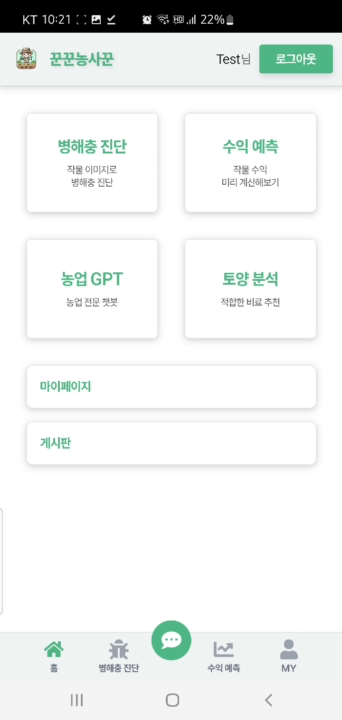
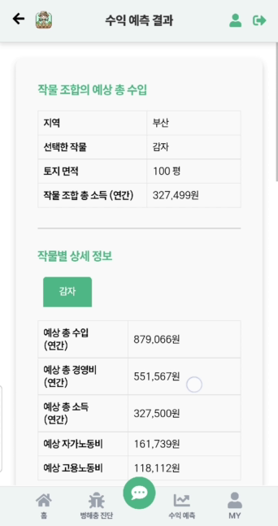
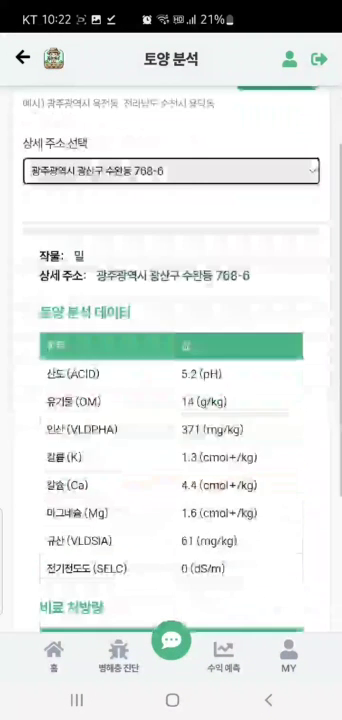
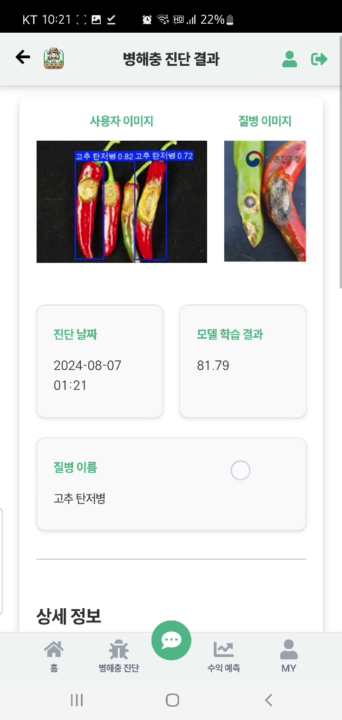
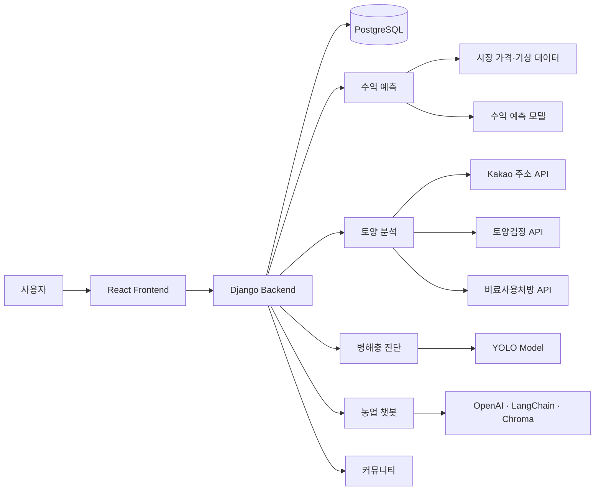

# 🌱 꾼꾼농사꾼

> **초보 농부를 위한 농업 코파일럿 플랫폼**\
> 작물 수익 예측 · 토양 분석 · 병해충 진단 · 농업 챗봇 · 커뮤니티를
> 하나의 서비스에서 제공

## 프로젝트 소개

농업을 처음 시작하는 사용자는 **작물 선정, 예상 수익, 토양 상태, 병해충
대응**에 필요한 정보를 여러 서비스에서 각각 찾아야 합니다.

**꾼꾼농사꾼**은 공공데이터와 AI 기술을 활용해 농업 의사결정에 필요한
정보를 하나의 흐름으로 제공하는 웹 서비스입니다.

-   **대상**: 귀농·귀촌인, 청년 농부 등 초보 농업인
-   **프로젝트**: KT AIVLE School 5기 빅프로젝트
-   **형태**: React SPA + Django API 기반 팀 프로젝트
-   **팀 구성**: 총 8명 · Frontend 3명 · Backend/AI 5명  
-   **핵심 기능**: 수익 예측 · 토양/비료 분석 · 병해충 진단 · AI 챗봇 ·
    농업 커뮤니티

------------------------------------------------------------------------

## 주요 기능

| 기능 | 설명 |
|---|---|
| **작물 수익 예측** | 지역·농지 면적·작물 비율을 입력해 예상 수익과 가격 추이를 시각화 |
| **토양 분석** | 주소 기반 필지별 토양 화학성 조회 및 작물별 비료 처방 제공 |
| **병해충 진단** | 작물 이미지를 업로드해 YOLO 모델로 병해충을 탐지하고 관련 정보 제공 |
| **농업 챗봇** | 농업 데이터 기반 RAG 챗봇을 통해 농업 관련 질의응답 제공 |
| **커뮤니티** | 판매·구매·품앗이 게시글과 댓글을 통한 사용자 간 정보 교류 |
| **회원 기능** | 회원가입·로그인·마이페이지 및 사용자별 예측/토양 데이터 관리 |

## 서비스 화면

<table>
  <tr>
    <th colspan="3" width="50%">메인 화면</th>
    <th colspan="3" width="50%">작물 수익 예측</th>
  </tr>
  <tr>
    <td align="center" colspan="3"></td>
    <td align="center" colspan="3"></td>
  </tr>
  <tr>
    <th colspan="2" width="33.33%">토양 분석 · 비료 처방</th>
    <th colspan="2" width="33.33%">병해충 탐지</th>
    <th colspan="2" width="33.33%">농업 챗봇</th>
  </tr>
  <tr>
    <td align="center" colspan="2"></td>
    <td align="center" colspan="2"></td>
    <td align="center" colspan="2"></td>
  </tr>
</table>

> 위 화면은 2024년 팀 프로젝트 최종 시연 영상에서 실제 모델과 서버가
> 동작하는 장면을 추출한 자료입니다. 현재 Repository의 실행 범위와 제한은
> [프로젝트 이후 개선](#프로젝트-이후-개선)에서 별도로 설명합니다.

------------------------------------------------------------------------

## 기술 스택

| 영역 | 기술 |
|---|---|
| **Frontend** | React, React Router, Axios, styled-components, MUI, Chart.js |
| **Backend** | Python, Django, Django REST Framework |
| **Database** | PostgreSQL |
| **AI / Data** | pandas, NumPy, scikit-learn, YOLO, PyTorch |
| **AI Chatbot** | OpenAI API, LangChain, Chroma |
| **External API** | 공공데이터포털, 기상청, 농촌진흥청, Kakao Local API |
| **Infra / Storage** | AWS, S3 |

------------------------------------------------------------------------

## 시스템 구성



------------------------------------------------------------------------

## 담당 역할 및 기여

### 1. 회원 인증 및 공통 UI

-   회원가입·로그인 화면 구현 및 Backend API 연동
-   메인 화면과 Header/Footer 등 공통 UI 구성
-   마이페이지·회원정보 화면 공동 개발
-   인증 상태에 따른 화면 이동과 사용자 피드백 처리

### 2. Community Frontend

-   판매·구매 중심의 게시판 UI 구현
-   게시글 목록·작성·상세·수정 흐름 개발
-   댓글 UI 및 Backend API 연동
-   내가 작성한 게시글 조회 화면 구현

### 3. Chatbot Frontend 공동 개발

-   챗봇 초기 화면과 대화 UI 구성
-   질문 입력 및 대화 세션 UI 구현
-   Backend 챗봇 API와 화면 흐름 연동

------------------------------------------------------------------------

## 핵심 기술 구현

### 작물 수익 예측

공공 시장가격·기상 데이터와 농산물 소득 데이터를 활용해 작물별 수익을
예측하고, 사용자가 선택한 **재배 면적과 작물 비율**에 따른 결과를
시각화합니다.

### 토양 분석 및 비료 처방

주소를 기반으로 필지를 조회하고 농촌진흥청 데이터를 연계해 **산도,
유기물, 유효인산 등 토양 화학성**과 작물별 비료 처방 정보를 제공합니다.

### YOLO 기반 병해충 진단

사용자가 업로드한 작물 이미지를 YOLO 모델로 분석하고 탐지된 병해충에
대한 **증상·발생 환경·예방 및 방제 정보**를 제공합니다.

### RAG 기반 농업 챗봇

농업 관련 데이터를 Vector DB에 구축하고 **LangChain · OpenAI · Chroma**
기반 RAG 구조를 적용해 사용자 질문과 관련된 정보를 검색한 뒤 답변을
생성합니다.

------------------------------------------------------------------------

## 프로젝트 구조

``` text
kunkunnongsakun/
├── frontend/
│   └── src/
│       ├── apis/
│       └── components/
│
└── backend/
    ├── login/
    ├── community/
    ├── prediction/
    ├── soil/
    ├── detect/
    └── selfchatbot/
```

------------------------------------------------------------------------

## 프로젝트 이후 개선

팀 프로젝트 종료 후 개인 포트폴리오 정리 과정에서 **기존 서비스의 기능을
유지하면서 실행 안정성과 코드 품질을 개선**했습니다.

-   Frontend·Backend Repository를 Git history를 보존한 monorepo로 통합
-   인증 상태를 Django Session 기반으로 정리하고 Route Guard 일관성 개선
-   Community 작성자 권한 및 CRUD 흐름 보완
-   Prediction 입력 검증과 사용자별 예측 Session 흐름 안정화
-   변경된 토양검정·비료사용처방 API 계약 최신화
-   외부 API·AI 모델 장애 시 잘못된 결과가 표시되지 않도록 오류 경계
    보강
-   Frontend·Backend 회귀 테스트 및 production build 검증
-   credential·runtime artifact를 source와 분리

------------------------------------------------------------------------

## 외부 데이터 및 API

-   한국농수산식품유통공사 농산물 가격 데이터
-   기상청 기상 데이터
-   농촌진흥청 토양검정 정보
-   농촌진흥청 비료사용처방 정보
-   Kakao Map API

현재 동작 여부와 추가 작업은 [API 및 외부 서비스 상태](./docs/API_STATUS.md)에
기능별로 기록합니다.

------------------------------------------------------------------------

## 현재 Repository 실행 범위

팀 프로젝트 당시에는 AWS·S3와 OpenAI 기반 RAG 환경을 포함해 전체 기능을
시연했습니다. 현재 공개 Repository는 과금과 credential 노출을 방지하기 위해
SQLite·로컬 파일 저장소를 기본값으로 사용하며, 외부 서비스는 필요한 환경이
설정된 경우에만 활성화됩니다.

| 기능 | 기본 상태 | 활성화 조건 |
|---|---|---|
| 인증·커뮤니티 | 사용 가능 | Backend·Frontend 로컬 실행 |
| 이미지 저장 | 사용 가능 | 기본 로컬 저장소, 선택적으로 S3 설정 |
| 토양·비료 분석 | 제한 | Kakao 및 공공데이터 API 키 필요 |
| 작물 수익 예측 | 제한 | 기상·시장가격 공공데이터 API 키 필요 |
| 농업 챗봇 | 비활성 | OpenAI 키, AI 의존성, Chroma 인덱스 필요 |
| 병해충 진단 | 비활성 | YOLO 실행 환경과 검증된 클래스 매핑 필요 |

Frontend는 `/api/capabilities/` 응답을 기준으로 외부 서비스 상태를 먼저
확인합니다. 키가 없거나 기능이 비활성화된 경우 요청 후 실패하는 대신 화면에서
`LIMITED` 상태를 안내하고 실행 버튼을 비활성화합니다. 이 API는 설정 여부만
반환하며 credential 값은 노출하지 않습니다.

외부 서비스를 운영 환경에서 일시 중지하려면 키를 삭제하지 않고 다음 기능
플래그를 사용할 수 있습니다.

``` dotenv
SOIL_SERVICE_ENABLED=false
PREDICTION_SERVICE_ENABLED=false
CHATBOT_ENABLED=false
```

### 농업 챗봇 선택 실행

원본 팀 저장소의 `chatbot.csv`처럼 `질문`, `답변` 열을 가진 자료를
`backend/artifacts/chatbot.csv`에 준비합니다. AI 의존성 설치 후 다음 명령으로
새 Chroma 인덱스를 생성할 수 있습니다. 임베딩 생성 과정에는 OpenAI API
비용이 발생합니다.

``` powershell
cd backend
.\.venv\Scripts\python.exe -m pip install -r requirements-ai.txt
.\.venv\Scripts\python.exe manage.py build_chatbot_index
```

인덱스 생성 후 `.env`에 다음 값을 설정합니다.

``` dotenv
CHATBOT_ENABLED=true
CHROMA_DB_PATH=artifacts/chroma
OPENAI_API_KEY=your-api-key
```

API 키는 Frontend 코드나 Git에 포함하지 않고 Backend 환경변수로만 관리합니다.

### 병해충 모델 선택 실행

팀 프로젝트의 YOLO checkpoint에서 확인한 6개 클래스는 숫자 DB PK가 아닌
명시적인 매핑 테이블로 연결합니다. 마이그레이션 후 매핑 fixture를 로드합니다.
동일한 `오이 노균병` 라벨을 가진 모델 클래스 2와 4도 같은 병해 레코드로
안전하게 연결됩니다.

``` powershell
cd backend
.\.venv\Scripts\python.exe manage.py migrate
.\.venv\Scripts\python.exe manage.py loaddata detect/fixtures/model_classes.json
```

공개 fixture에는 모델에서 확인된 병명과 클래스 계약만 포함하며, 검증되지 않은
증상·농약·방제 정보는 만들어 넣지 않습니다. 해당 상세 정보는 공신력 있는 출처를
확인한 뒤 별도로 보강해야 합니다.
