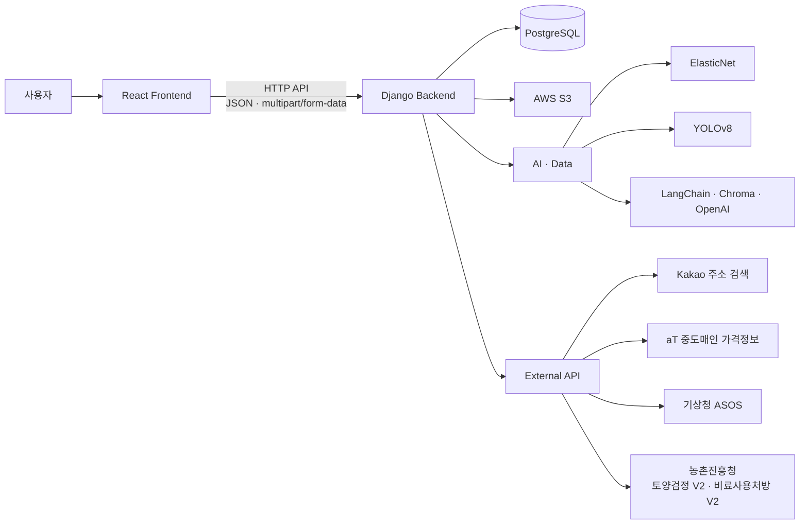

# 🌱 농업코파일럿

> **AI와 공공데이터를 활용해 수익 분석부터 병해충·토양·영농 상담까지 지원하는 초보 농업인용 서비스**

농업을 처음 시작하는 사용자가 작물 재배와 영농 의사결정에 필요한 **시장가격·기상·토양·병해충 정보**를 하나의 서비스에서 활용할 수 있도록 개발했습니다.

농작물 수익 분석, AI 병해충 진단, 토양검정·비료 처방, 농업 AI 챗봇과 커뮤니티를 제공하며, **React Frontend와 Django Backend를 중심으로 AI 모델과 농업 관련 외부 데이터를 연동**했습니다.

> **KT AIVLE School 5기 빅프로젝트**

---

## 프로젝트 정보

| 항목 | 내용 |
| --- | --- |
| **개발 기간** | 2024.06.17 ~ 2024.07.30 |
| **개발 인원** | 6명 — Frontend 2 · Backend 2 · AI/Server 2 |
| **담당** | **Frontend — 공통 UI · 주요 기능 연동 중심** |
| **Frontend** | React · React Router · Axios · styled-components · Chart.js |
| **Backend** | Django · PostgreSQL |
| **AI · Data** | ElasticNet · YOLOv8 · LangChain · Chroma · OpenAI |
| **Infra · Storage** | AWS · S3 |

---

## 주요 기능

| 기능 | 설명 |
| --- | --- |
| **농작물 수익 분석** | 재배 지역·면적·작물·재배 비율을 바탕으로 예상 소득과 시장가격 분석 결과 제공 |
| **AI 병해충 진단** | 작물 이미지를 YOLO 기반 모델로 분석하고 병해충의 증상·발생 환경·방제 정보 제공 |
| **토양검정 · 비료 처방** | 농지 주소를 기반으로 토양 화학성을 조회하고 선택한 작물에 맞는 비료 처방 제공 |
| **농업 AI 챗봇** | 관련 농업 지식을 검색해 답변 생성에 활용하는 RAG 기반 질의응답 및 대화 이력 관리 |
| **농업 커뮤니티** | 판매·구매 게시판의 게시글·댓글을 통한 사용자 간 정보 공유 |
| **회원 · 마이페이지** | 회원가입·로그인 및 회원정보·사용자 활동 관리 |

---

## 서비스 화면

<table>
  <tr>
    <th colspan="3" width="50%">메인 화면</th>
    <th colspan="3" width="50%">농작물 수익 분석</th>
  </tr>
  <tr>
    <td align="center" colspan="3">
      
    </td>
    <td align="center" colspan="3">
      
    </td>
  </tr>
  <tr>
    <th colspan="2" width="33.33%">토양검정 · 비료 처방</th>
    <th colspan="2" width="33.33%">AI 병해충 진단</th>
    <th colspan="2" width="33.33%">농업 AI 챗봇</th>
  </tr>
  <tr>
    <td align="center" colspan="2">
      
    </td>
    <td align="center" colspan="2">
      
    </td>
    <td align="center" colspan="2">
      
    </td>
  </tr>
</table>

> 서비스 화면은 팀 프로젝트 최종 시연 자료를 기준으로 구성했습니다.

---

## 기술 스택

| 영역 | 기술 |
| --- | --- |
| **Frontend** | React 18 · React Router · Axios · styled-components · Chart.js · Create React App |
| **Backend** | Python · Django 5 |
| **Database** | PostgreSQL |
| **AI · Data** | pandas · NumPy · scikit-learn · YOLOv8 · PyTorch |
| **RAG** | OpenAI · LangChain · Chroma |
| **External Data** | Kakao 주소 검색 · aT 중도매인 가격정보 · 기상청 ASOS · 농촌진흥청 토양검정 V2 · 비료사용처방 V2 |
| **Infra · Storage** | AWS · S3 |

---

## 시스템 아키텍처



Frontend에서 일반 데이터는 JSON, 병해충 진단 이미지는 `multipart/form-data`로 Django API에 전달합니다.

Backend는 PostgreSQL을 중심으로 서비스 데이터를 관리하며, AWS S3와 AI 모델, 농업 관련 외부 API를 기능에 따라 연동했습니다.

> 위 구성은 프로젝트 최종 서비스 아키텍처입니다. 현재 Repository의 기본 Local 실행은 재현성을 위해 SQLite와 Django `FileSystemStorage`를 사용합니다.

---

## Frontend 담당 및 기여

저는 Frontend 개발을 중심으로 **공통 UI와 주요 사용자 흐름을 구현하고, Django Backend 및 AI·공공데이터 기능을 React 화면과 연결**했습니다.

| 영역 | 담당 내용 |
| --- | --- |
| **공통 구조** | MainLayout · TopBar · GNB · 주요 Route 및 Navigation |
| **API 연동** | Axios Instance · 기능별 API Module |
| **회원 · 인증** | 로그인 · 회원가입 · Session 인증 연동 · 인증 상태 기반 UI |
| **마이페이지** | 회원정보 · 비밀번호 · 회원 탈퇴 · 사용자 활동 화면 |
| **커뮤니티** | 게시글·댓글 CRUD · Pagination · 작성자 기반 UI |
| **농작물 수익 분석** | 입력 Form · API 연동 · 결과 및 Chart 화면 |
| **AI 병해충 진단** | 이미지 Upload · API 연동 · 결과 · 진단 이력 |
| **토양검정 · 비료 처방** | 작물·주소 입력 · 토양 조회 · 시료 선택 · 비료 처방 연동 |
| **농업 AI 챗봇** | 대화 Session · Message UI · Chat API · 대화 이력 |

AI 모델 개발과 Backend 전체 구현은 각 담당자가 진행했으며, 저는 AI·데이터 기능을 **사용자가 실제로 이용할 수 있는 Frontend 흐름으로 연결하는 역할**을 담당했습니다.

Frontend 구현 과정에서 화면에 필요한 요청·응답 데이터를 확인하고, 일부 Backend Response Contract 조정에도 참여했습니다.

---

## Frontend 구조

### 기능별 API Layer

화면 Component와 Backend 통신의 책임을 분리하기 위해 HTTP 요청을 **기능별 API Module로 구성하고 공통 설정을 Axios Instance에서 관리**했습니다.

```text
사용자 Interaction
       ↓
Page · Template
       ↓
기능별 API Module
       ↓
Axios Instance
       ↓
Django API
       ↓
React State
       ↓
결과 UI
```

이를 통해 Component가 Endpoint와 요청 설정을 직접 관리하는 범위를 줄이고, 화면 상태와 사용자 Interaction에 집중하도록 역할을 분리했습니다.

### Session 기반 인증

인증 여부는 Frontend에 저장된 값만으로 판단하지 않고 **Django Session을 기준으로 확인**합니다.

```text
Django Session
      ↓
인증 상태 확인 API
      ↓
Frontend 인증 상태
      ↓
Route · UI 접근 제어
```

Axios는 Session Cookie가 후속 요청에 전달되도록 구성하고, 인증 상태 확인 결과를 Frontend 상태에 반영해 Route와 UI 접근 조건에 사용합니다.

---

## AI · 데이터 기능

### 농작물 수익 분석

재배 조건을 바탕으로 **예상 소득을 계산**하고, aT 중도매인 가격정보와 기상청 ASOS 데이터를 활용한 ElasticNet 모델의 **다음 시장가격 예측 결과**를 함께 제공합니다.

예상 소득 계산과 시장가격 예측은 서로 다른 처리 과정으로 구성했습니다.

### AI 병해충 진단

사용자가 업로드한 작물 이미지를 YOLOv8 기반 모델로 분석하고, 탐지 결과를 병해충 데이터와 연결해 증상·발생 환경·방제 정보를 제공합니다.

Frontend에서는 이미지 Upload부터 분석 결과, 상세 정보와 진단 이력까지 하나의 사용자 흐름으로 연결했습니다.

### 토양검정 · 비료 처방

Kakao 주소 검색을 통해 농지 정보를 확인한 뒤 농촌진흥청 토양검정 V2 데이터를 조회합니다.

사용자가 토양 시료를 선택하면 해당 토양 정보와 작물을 바탕으로 농촌진흥청 비료사용처방 V2를 연계해 처방 결과를 제공합니다.

### 농업 AI 챗봇

농업 관련 지식을 Chroma에서 검색하고, 검색된 Context를 활용해 OpenAI LLM이 답변을 생성하는 RAG 구조를 사용합니다.

LangChain을 통해 검색과 Context 구성, LLM 호출을 연결하며 대화는 Session 단위로 관리합니다.

---

## 외부 데이터 · API

| 서비스 | 사용 목적 |
| --- | --- |
| **Kakao 주소 검색** | 농지 주소 검색 및 필지 정보 변환 |
| **aT 중도매인 가격정보** | 농작물 시장가격 분석 |
| **기상청 ASOS** | 시장가격 분석을 위한 기상 정보 |
| **농촌진흥청 토양검정 V2** | 토양 화학성 조회 |
| **농촌진흥청 비료사용처방 V2** | 작물별 비료 처방 조회 |

외부 서비스별 마지막 실제 호출 검증 결과와 검증 시점은 [`API_STATUS.md`](./docs/reference/API_STATUS.md)에 별도로 기록합니다.

---

## 프로젝트 이후 개선

> 아래 작업은 **팀 프로젝트 종료 후 개인 유지보수 과정에서 진행한 작업**입니다.

프로젝트 종료 후 시간이 지난 Repository를 다시 실행·분석하며, 기존 기능을 전면 재작성하기보다 **당시의 기능과 설계를 보존하면서 현재 환경에서도 실행하고 검증할 수 있는 상태로 복구·개선**했습니다.

### Frontend 구조 개선

- Django Session 기반 인증 상태 공통 관리
- 인증 상태에 따른 Route Guard 정리
- 기능별 API Module과 공통 Axios 요청 구조 개선
- 반복되는 비동기 Loading · Error 처리 정리
- 외부 데이터의 Empty State와 실제 Error 구분

### 외부 서비스 · 실행환경 복구

- Kakao 주소 검색 및 농업 공공데이터 API 연동 재검증
- aT 중도매인 가격정보 · 기상청 ASOS 연동 검증
- 농촌진흥청 토양검정 V2 · 비료사용처방 V2 연동 정리
- YOLO Model Artifact와 Class Mapping 검증
- RAG · Chroma 실행 구조와 데이터 계약 점검
- Dependency · 환경변수 · Credential 관리 구조 정리

### 회귀 검증

| 검증 항목 | 결과 |
| --- | ---: |
| **Frontend Test Suites** | 28 / 28 PASS |
| **Frontend Tests** | 140 / 140 PASS |
| **Backend Tests** | 114 PASS |
| **Frontend Lint** | PASS |
| **Frontend Production Build** | PASS |
| **Django System Check** | PASS |
| **Python Dependency Check** | PASS |

코드 수정 이후 자동화 테스트와 Build뿐 아니라 주요 AI·외부 데이터 기능의 실행 조건과 요청 흐름을 다시 확인했습니다.

---

## 프로젝트 구조

```text
kunkunnongsakun/
├── frontend/
│   ├── src/
│   └── package.json
│
├── backend/
│   ├── config/
│   ├── login/
│   ├── community/
│   ├── prediction/
│   ├── detect/
│   ├── soil/
│   ├── chatbot/
│   ├── requirements.txt
│   └── requirements-ai.txt
│
└── docs/
    ├── SETUP.md
    └── reference/
```

기본 Backend Dependency와 YOLO·챗봇 실행에 필요한 AI Dependency를 분리해 관리합니다.

---

## Local 실행

현재 포트폴리오 Repository는 **SQLite와 Django `FileSystemStorage`를 기본 Local 실행 환경**으로 사용합니다.

외부 API와 AI Artifact 없이도 인증·회원·커뮤니티 등 기본 기능을 실행할 수 있으며, AI·공공데이터 기능은 필요한 Credential과 Artifact를 추가해 활성화합니다.

### Backend

```text
cd backend
→ Virtual Environment 생성
→ requirements.txt 설치
→ .env 설정
→ manage.py migrate
→ manage.py runserver
```

기본 Backend 주소는 `http://127.0.0.1:8000`입니다.

### Frontend

```bash
cd frontend
npm ci
npm start
```

기본 Frontend 주소는 `http://localhost:3000`입니다.

Frontend의 Backend API 주소는 다음 환경변수로 설정하며, 미설정 시 `http://localhost:8000`을 기본값으로 사용합니다.

```dotenv
REACT_APP_API_BASE_URL=http://localhost:8000
```

> Windows · POSIX별 Backend 설정, 환경변수, Database, AI Artifact, 외부 API, PostgreSQL 및 AWS S3 설정은 **[Local Setup Guide](./docs/SETUP.md)**를 참고해 주세요.

### AI 기능 실행

공개 Repository에는 YOLO checkpoint와 생성된 Chroma DB가 포함되지 않습니다.

- **AI 병해충 진단** — 별도 YOLO checkpoint, AI Dependency와 Class Mapping 필요
- **농업 AI 챗봇** — OpenAI API, AI Dependency와 유효한 Chroma Index 필요

자세한 준비 과정과 검증 명령은 [Local Setup Guide](./docs/SETUP.md)에 정리했습니다.

---

## 테스트 · 검증

현재 Repository를 기준으로 다음 명령을 통해 Frontend와 Backend 상태를 검증할 수 있습니다.

### Backend

```bash
python manage.py check
python manage.py test
```

### Frontend

```bash
npm run lint
npm test -- --watchAll=false --runInBand
npm run build
```

실제 검증 환경과 OS별 정확한 명령, AI · 외부 서비스 점검 방법은 [Local Setup Guide](./docs/SETUP.md)를 참고해 주세요.

---

## 문서

| 문서 | 내용 |
| --- | --- |
| **[Local Setup Guide](./docs/SETUP.md)** | Local 실행 · 환경변수 · Database · AI Artifact · 외부 API · Storage · 테스트 |
| **[API / External Service Status](./docs/reference/API_STATUS.md)** | 외부 API와 서비스의 실제 호출 검증 결과 및 검증 시점 |
| **Technical Case Study** | 요구사항 · Frontend 설계 · 시스템 아키텍처 · 핵심 구현 · 트러블슈팅 · 기술적 의사결정 · 테스트 · 개인 기여 |

---

## 프로젝트를 통해 얻은 경험

### Frontend와 Backend 사이의 Interface 설계

AI와 공공데이터 기능을 화면에 연결하면서 Frontend가 단순히 API 결과를 표시하는 계층에 그치지 않는다는 점을 경험했습니다.

Request · Response Contract, Session 인증, 이미지 Upload와 비동기 상태 등 **서로 다른 Backend 처리 방식을 사용자가 예측 가능한 화면 흐름으로 변환하는 과정**이 중요했습니다.

이를 통해 화면 구현과 함께 **Frontend와 Backend 사이의 데이터 흐름과 Interface까지 고려하는 개발 경험**을 쌓았습니다.

### 완료된 프로젝트를 다시 검증하는 경험

프로젝트 종료 후 시간이 지난 Repository를 다시 실행하면서 Dependency, 외부 API, Credential, AI Artifact와 실행환경이 모두 프로젝트의 재현 가능성에 영향을 준다는 점을 확인했습니다.

기존 코드를 무조건 최신 방식으로 변경하기보다 **기존 동작과 구현 의도를 이해하고 필요한 범위만 수정한 뒤 테스트와 실제 실행으로 검증하는 유지보수 과정**을 경험했습니다.

---

## 상세 기술 문서

> **농업코파일럿 Technical Case Study**
>
> 문제 정의와 사용자 흐름부터 Frontend 구조, 시스템 아키텍처, AI·공공데이터 연동, 트러블슈팅, 기술적 의사결정, 테스트와 개인 기여까지 상세하게 정리했습니다.

**상세 기술 문서 링크**

> 최종 공개 URL 연결 예정